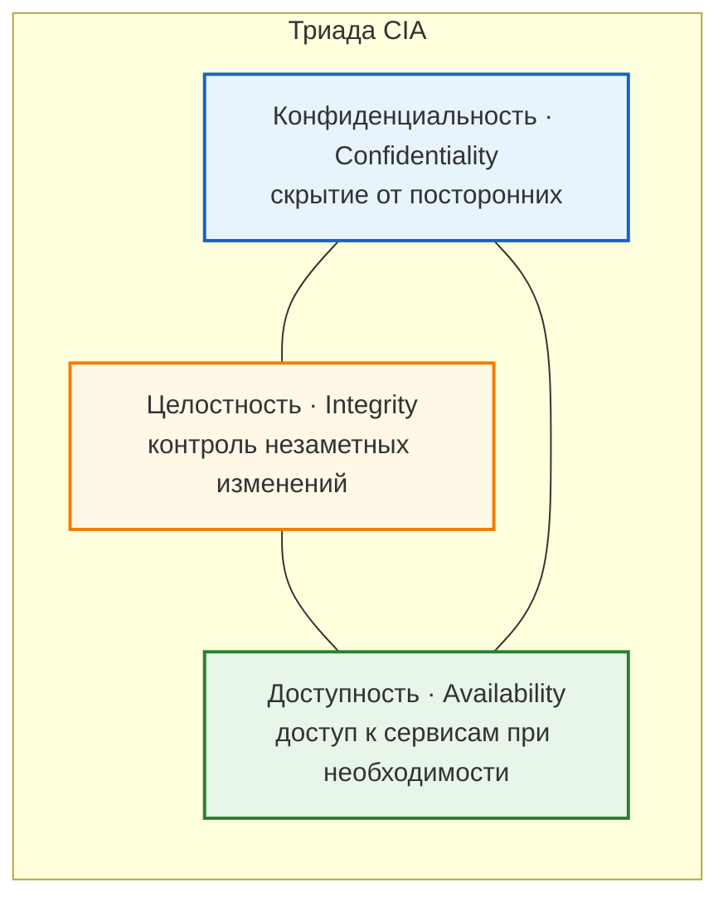
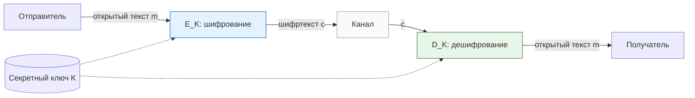
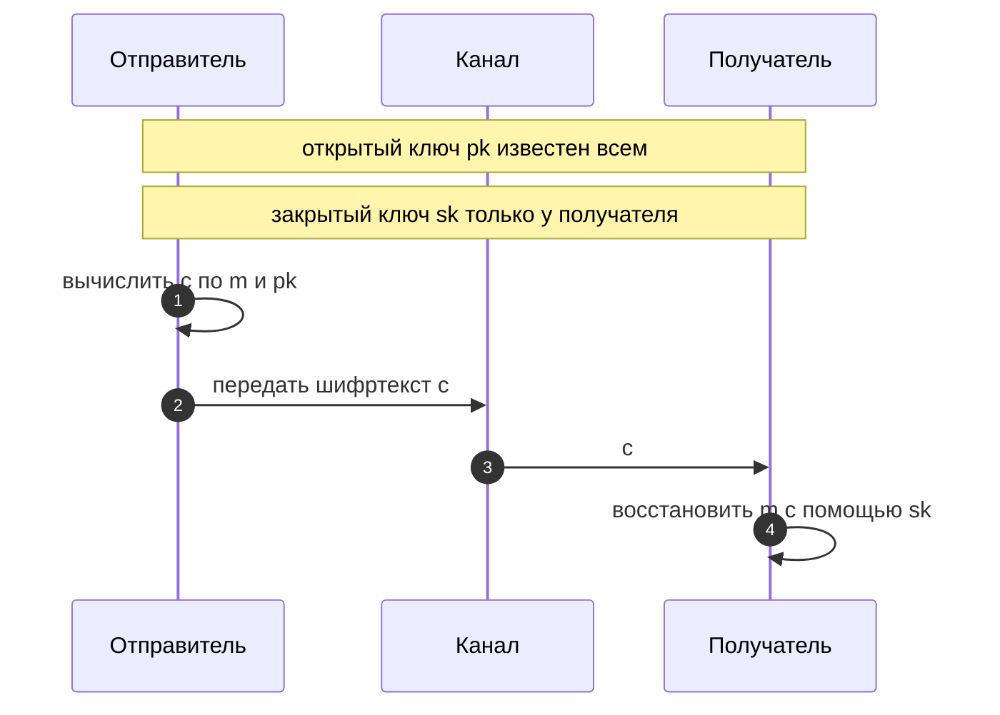
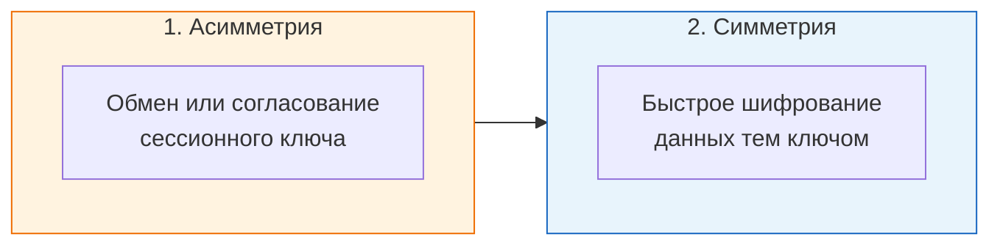

# Лабораторная работа 15: Симметричное шифрование (Linux VM)

Этот документ объясняет ключевые идеи лабораторной работы и даёт пошаговую инструкцию по запуску и выполнению в Linux VM.

> Важно: алгоритмы в этой работе являются учебными моделями и не предназначены для промышленной защиты данных.


## Цели лабораторной работы

После выполнения студент должен уметь:
- реализовать обобщённый шифр Цезаря для Unicode-кодов;
- реализовать шифр Виженера (циклический буквенный ключ) и сравнить его с Цезарем;
- выполнить базовый частотный анализ шифртекста Цезаря;
- реализовать шифр Вернама/XOR (повторяющийся ключ и модель OTP);
- реализовать упрощённую CBC-подобную схему;
- встроить шифрование и дешифрование в обмен сообщениями по TCP.

## Навигация по лабораторной

1. Теория: CIA, симметрия/асимметрия, TLS/SSL (кратко).
2. Ноутбук: Цезарь -> Виженер -> частотный анализ Цезаря -> XOR/OTP -> CBC.
3. Практика TCP: зашифрованный обмен клиент-сервер.
4. Контрольные вопросы и итоговый тест.

### Файлы ноутбуков

- `lab_symmetric_ciphers_ru.ipynb` — рабочий вариант для студента (блоки `TODO`).
---

## Теоретический контекст: триада CIA и виды шифрования

 **Симметричное и асимметричное шифрование** — разные способы обеспечить в первую очередь **конфиденциальность**; **целостность** и **аутентичность** данных в продакшене часто добавляют отдельными механизмами (MAC, подписи, AEAD).

### Триада CIA (Confidentiality, Integrity, Availability)

Классическая модель целей информационной безопасности:

| Цель (EN) | Кратко |
|-----------|--------|
| **Confidentiality** (конфиденциальность) | Данные не раскрываются неавторизованным сторонам. |
| **Integrity** (целостность) | Данные не изменяются незаметно для полномочных пользователей. |
| **Availability** (доступность) | Авторизованные пользователи получают доступ к сервисам и данным, когда это требуется. |

**Важно:** симметричное шифрование усиливает **конфиденциальность** (секретность содержимого). **Целостность** и **аутентичность** сообщений в реальных системах обычно обеспечивают отдельно (хэши, MAC, цифровые подписи, режимы **AEAD**). **Доступность** определяется устойчивостью сервисов и сети к отказам и атакам (например, DoS), а не выбором шифра.

Связь трёх целей можно представить так:



### Симметричное шифрование

Для шифрования и дешифрования используется **один и тот же секретный ключ** (или ключи, однозначно получаемые из одного секрета — по определению конкретного алгоритма). Стороны должны **заранее согласовать** ключ или **безопасно обменяться** им. Симметричные примитивы обычно **быстры** и подходят для больших объёмов данных (например, AES, ChaCha20). В ноутбуке (Цезарь, XOR, модель OTP) показаны **учебные модели**, а не промышленные конструкции.



`E_K` и `D_K` — прямое и обратное преобразование для выбранного алгоритма (для XOR на битах/кодах часто совпадают одной операцией).

Отправитель и получатель владеют одним и тем же секретом `K`; конкретные функции `E` и `D` задаются выбранным алгоритмом.

### Асимметричное шифрование (криптография с открытым ключом)

Используется **пара ключей**: **открытый** (публичный, `pk`) и **закрытый** (секретный, `sk`). В типичной схеме шифрования для получателя сообщение шифруют **открытым** ключом получателя, а расшифровать может только тот, у кого есть соответствующий **закрытый** ключ. Асимметричные операции обычно **медленнее** симметричных, поэтому для длинных данных применяют **гибридную схему**: асимметрично согласуют **сессионный** симметричный ключ, а полезную нагрузку шифруют симметрично (например, AES-GCM). Схема ниже — **упрощённая** иллюстрация передачи шифртекста (без деталей конкретной схемы вроде RSA-KEM или ECIES).



Типичная **гибридная** схема в приложениях (упрощённо):



При **цифровой подписи** распределение ролей **другое**: подпись создают **закрытым** ключом, проверяют **открытым** (это про **аутентичность** и **целостность**, а не про сокрытие содержимого).

### TLS и SSL

- **SSL** (Secure Sockets Layer) — историческое семейство протоколов, в современных системах считается устаревшим и небезопасным.
- **TLS** (Transport Layer Security) — современный стандарт защищённого канала поверх TCP (HTTPS, защищённые API и др.).
- На этапе **рукопожатия** стороны согласуют криптографические параметры, проверяют сертификат сервера и получают общий сессионный ключ.
- Далее трафик защищается, как правило, **симметричным AEAD-шифрованием** (например, AES-GCM или ChaCha20-Poly1305), так как оно быстрее для больших объёмов данных.
- Поэтому в реальных системах обычно используется гибридная идея: асимметрия/рукопожатие для ключей + симметрия для данных.

---

## 1) Подготовка рабочего каталога в Linux VM

Откройте терминал и выполните:

```bash
cd ~
git clone https://github.com/Mohanad0101/lab15_symmetric.git
cd lab15_symmetric
```
---

## 2) Создание виртуального окружения Python

Создайте и активируйте виртуальное окружение:

```bash
python3 -m venv .venv
source .venv/bin/activate
python -m pip install --upgrade pip
```

Установите JupyterLab:

```bash
pip install jupyterlab
pip install ipywidgets
```

---

Проверка:

```bash
ls -la ~/lab15_symmetric
```
lab_symmetric_ciphers_ru.ipynb
---

## 4) Запуск JupyterLab и выполнение ноутбука

Находясь в `~/lab15_symmetric` (при активном `.venv`), выполните:

```bash
jupyter lab
```

Далее:
1. откройте `lab_symmetric_ciphers_ru.ipynb`;
2. выполняйте ячейки сверху вниз;
3. реализуйте все блоки `TODO`;
4. используйте интерактивные проверки результатов.

---

## 5) Рекомендуемый порядок реализации

1. `caesar_encrypt`, `caesar_decrypt`
2. `vigenere_encrypt`, `vigenere_decrypt`
3. `caesar_crack_assuming_space`
4. функции Vernam/XOR (повторяющийся ключ)
5. функции OTP
6. CBC-подобные функции
7. TCP-интеграция (server/client)

---

## 6) TCP-часть: обмен зашифрованными сообщениями

Студент должен создать каталог `app/` и реализовать сетевую часть в нём.

```bash
cd ~/lab15_symmetric
mkdir -p app
```

Рекомендуемые файлы:
- `app/server.py`
- `app/client.py`
- `app/crypto_adapter.py` (по желанию)

> **Замечание:** в готовом примере `client.py` импортирует функции шифрования из `server.py` — это сделано намеренно: **один источник правды** для ключа и формата линии. При желании вынесите общий код в `crypto_adapter.py` и импортируйте его из обоих файлов.

### Функциональные требования

Клиент и сервер должны обмениваться **зашифрованными** сообщениями:
- клиент: открытый текст -> шифрование -> упаковка -> отправка;
- сервер: приём -> распаковка -> дешифрование -> обработка -> шифрование -> упаковка -> отправка;
- клиент: приём -> распаковка -> дешифрование -> вывод ответа.
---

## 7) Быстрая проверка работы

1. Запустите сервер:

```bash
python app/server.py
```

2. В другом терминале запустите клиент:

```bash
python app/client.py
```

3. Проверьте:
- сервер корректно выводит расшифрованное входящее сообщение;
- клиент получает и корректно расшифровывает ответ;
- при несовпадении ключей дешифрование нарушается (ожидаемо).

---

## 8) Что сдавать

- заполненный `lab_symmetric_ciphers_ru.ipynb` (все `TODO` реализованы);
- выводы или скриншоты интерактивных проверок;
- каталог `app/` с TCP server/client для обмена зашифрованными сообщениями;
- краткий отчёт:
  - выбранный алгоритм для TCP-обмена;
  - поведение при несовпадении ключей;
  - краткое сравнение Цезаря, Виженера и XOR/CBC.

